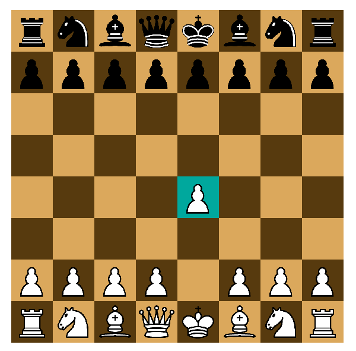

# Desktop Chess

This is an implementation of chess in C++ using the [SDL library](https://www.libsdl.org).



The project contains:

- A core chess library handling game logic (`src/chess/`)
- A graphical chess application using SDL (`src/chess_app/`)
- A testing framework for the legality of moves (`tests/`)

### Technologies used

This project uses [CMake](https://cmake.org) to support cross-platform builds
and contains vendored copies of [SDL](https://github.com/libsdl-org/SDL) and its
add-ons as [submodules](https://git-scm.com/book/en/v2/Git-Tools-Submodules).
This project uses an experimental build of
[SDL 3](https://github.com/libsdl-org/SDL/milestone/10) because I preferred the
use of floating point for more precise rendering of objects.

## Building and running locally

### Windows (Visual Studio)

1. Ensure Visual Studio is installed with
   [CMake tools for Windows](https://learn.microsoft.com/en-us/cpp/build/cmake-projects-in-visual-studio?view=msvc-170).
2. Set up the repository:

```bash
git clone https://github.com/NeekTheGiraffe/chess.git
cd chess
git submodule update --init                      # Initialize direct submodules
cd src/vendor/SDL_ttf
git submodule update --init external/freetype    # Only required nested submodule
```

3. Open the `chess` folder in Visual Studio.
4. Visual Studio should detect this as a CMake project and automatically
   configure it. If not: **Project > Configure Desktop Chess**.
5. Select the startup item as `mygame.exe` and run it.

### Unix

1. Ensure CMake and [FreeType](http://freetype.org) are installed, using the
   package manager for your system (e.g. `apt install libfreetype6-dev`).
2. Set up the repository:

```bash
git clone https://github.com/NeekTheGiraffe/chess.git
cd chess
git submodule update --init
```

3. Build:

```bash
mkdir build
cd build
cmake ..
cmake --build .
```

4. Run the program:

```bash
./mygame
```

### Controls

- To make a move on your turn, drag and drop your chess pieces with the mouse.
- To promote a pawn, drag and drop the pawn to the promotion square and click
  the desired upgraded piece.

## Testing

### Windows

In Visual Studio, click **Test > Run CTests for Desktop Chess**.

### Unix

In the `build` directory, run `ctest`.

## Future directions

- Better visuals
- Recording of match history and stepping through a match
- Time limits
- Multiplayer functionality
